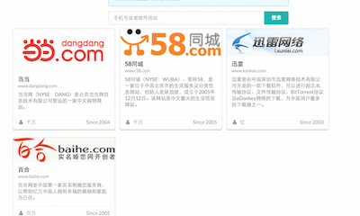

# checkReg
here is the test branch, and keep the master clean
检测一个邮箱或手机号在互联网上的注册情况

部署在 新浪云服务器地址：[checkReg](http://checkreg.sinaapp.com/)

比如输入 110.qq.com。（据说是马化腾的邮箱）




对每个网站的请求在plugin文件里面，以当当网为例：

```
{
  "name":"当当",
  "date":"2004",
  "scale":"千万",
  "description":"当当网（NYSE：DANG）是北京当当网信息技术有限公司营运的一家中文购物网站。",
  "url":"www.dangdang.com",
  "icon":"https://login.dangdang.com/images/ddnewhead_logo.gif",
  "method":"post",
  "request":{
    "mailUrl":"https://login.dangdang.com/p/email_checker.php",
    "phoneUrl":"https://login.dangdang.com/p/mobile_checker.php"
  },
  "postField":{
    "mailField":"email",
    "phoneField":"mobile"
  },
  "yesCode":{
    "mailCode":"true",
    "phoneCode":"true"
  }
}
```
上面的JSON文件最重要的是`request`,`postField`和`yesCode`。分别表示：验证邮箱或手机的URL请求地址，POST请求（如果是）的字段，如果已注册的返回字符串。

对于返回较长的，例如百合网，我们只取前面包含code部分的：

```
  "yesCode":{
    "mailCode":"{\"state\":0,",
    "phoneCode":"{\"state\":0,"
  }
```
但你可以选择别的处理方式，然后在代理里修改。

目前只纳入了360，当当，百合网，A站，CSDN，迅雷等几个网站，欢迎大家Folk本项目并提交或修改plugins里面的json文件。

上面JSON文件的request等是在各网站的注册页面捕获的，但有些网站处理起来稍显麻烦。比如，360现在只允许手机注册，所有我们没有收纳他的有邮箱检测方式。对于这些问题，后期将慢慢处理。

最后，特别感谢 [Sreg](https://github.com/ff0000team/Sreg)。

由于网页使用了谷歌字体，如果你所在的网络环境不能翻墙，可能请求时间较长且UI效果不佳。


